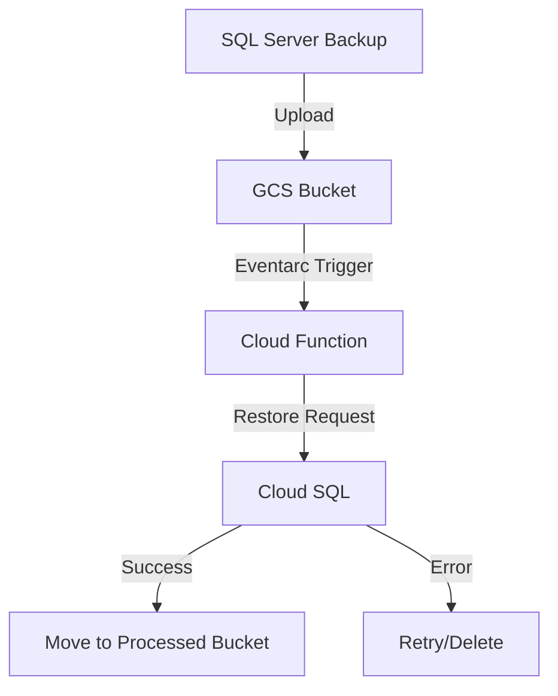

# Automated Transaction Log Restoration for Cloud SQL for SQL Server  

**Automate the restoration of SQL Server transaction log backups (full/differential/T-log) to Cloud SQL for SQL Server using event-driven Cloud Functions.**  

---

## 📖 Table of Contents  
- [Overview](#-overview)  
- [Key Features](#-key-features)  
- [Architecture & Workflow](#-architecture--workflow)  
- [Prerequisites](#-prerequisites)  
- [Setup & Configuration](#-setup--configuration)  
  - [Cloud Function Deployment](#1-cloud-function-deployment)  
  - [On-Premises SQL Server Backup Automation](#2-on-premises-sql-server-backup-automation)  
  - [Scheduled Upload Script Setup](#3-scheduled-upload-script-setup)  
- [Testing](#-testing)  
- [Error Handling & Retry Logic](#-error-handling--retry-logic)  
- [Permissions & IAM Roles](#-permissions--iam-roles)  
- [References](#-references)  

---

## 🌟 Overview  
This solution automates the restoration of SQL Server backups (full, differential, or transaction log) to a Cloud SQL for SQL Server instance. When backups are uploaded to a Google Cloud Storage (GCS) bucket, an Eventarc trigger invokes a Python Cloud Function to restore the backup. Key use cases include:  
- **Disaster Recovery (DR)**: Sync backups from primary to Cloud SQL DR instances.  
- **Migration**: Import existing backups into Cloud SQL.  
- **Continuous Restoration**: Maintain synchronization using transaction logs.  

🔗 [Cloud SQL Import Documentation](https://cloud.google.com/sql/docs/sqlserver/backup-import#transaction-log)  

---

## 🚀 Key Features  
- **Supported Backup Types**  
  - Full | Differential | Transaction Log  
- **Restoration Modes**  
  - **Recovery Mode**: Restore with `WITH RECOVERY` for immediate database access.  
  - **No Recovery Mode (Default)**: Leave database in restoring state for sequential restores.  
- **Metadata Sources**  
  - **Filename Parsing**: Extract metadata from filenames (e.g., `instance_db_log_norecovery_20231001.trn`).  
  - **Object Metadata**: Use GCS object tags (e.g., `CloudSqlInstance`, `DatabaseName`).  
- **Automated File Management**  
  - Move processed files to a `processed` bucket.  
  - Retry failed operations with exponential backoff (up to 7 days).  

---

## 🏗️ Architecture & Workflow  

 1-Backup Upload: Transaction logs are uploaded to a GCS bucket.
 2- Event Trigger: Eventarc invokes the Cloud Function.
 3- Restoration:

        The function identifies backup type (full/diff/log) and recovery mode.

        Submits a restore request to Cloud SQL.

    4- Post-Restore Actions:

        Success: Move file to processed bucket and delete from source.

        Failure: Retry based on error type (e.g., SQL error 4305/4326).
        ### 1. Cloud Function Deployment

 #### ✅ Prerequisites
Tools & Services

    Google Cloud Project with billing enabled.

    SQL Server Instance: On-premises or Cloud SQL.

    Software:

        gcloud CLI

        PowerShell 5.1+

        Google Cloud PowerShell Module

#### Create a Service Account
```bash
# Create a service account for the Cloud Function
gcloud iam service-accounts create cloud-function-sql-restore-log \
  --display-name "Cloud Function Service Account"
```

#### Grant Permissions
```bash
# Assign Cloud SQL Editor role
gcloud projects add-iam-policy-binding ${PROJECT_ID} \
  --member="serviceAccount:cloud-function-sql-restore-log@${PROJECT_ID}.iam.gserviceaccount.com" \
  --role="roles/cloudsql.editor"

# Grant Storage Object Admin access
gcloud storage buckets add-iam-policy-binding gs://${BUCKET_NAME} \
  --member="serviceAccount:cloud-function-sql-restore-log@${PROJECT_ID}.iam.gserviceaccount.com" \
  --role="roles/storage.objectAdmin"
```

#### Deploy the Cloud Function
```bash
# Deploy with specific parameters
gcloud functions deploy restore-sql-logs \
  --gen2 \
  --region=us-central1 \
  --runtime=python312 \
  --source=. \
  --entry-point=fn_restore_log \
  --trigger-bucket=gs://${BUCKET_NAME} \
  --set-env-vars PROJECT_ID=${PROJECT_ID},USE_FIXED_FILE_NAME_FORMAT=True \
  --service-account=cloud-function-sql-restore-log@${PROJECT_ID}.iam.gserviceaccount.com
```
## 🖥️ On-Premises SQL Server Backup Automation

### Configure Transaction Log Backups

1. **Set Recovery Model to FULL** (via SSMS):  
   ```sql
   ALTER DATABASE [YourDB] SET RECOVERY FULL;
2 **Create SQL Server Agent Job:**
    Step: Run T-SQL script for transaction log backups.
    Schedule: Recurring (e.g., every 15 minutes).
         ```BACKUP LOG [YourDB] TO DISK = N'C:\Backups\YourDB_Log.trn';
    ---------------------------------------------------------------------------------------
    Automate Uploads with PowerShell

    Create Upload Service Account:
    bash
    Copy

    gcloud iam service-accounts create tx-log-uploader \
      --display-name="Transaction Log Uploader"

    Configure Upload Script:
    Update constants in upload-script.ps1:
    powershell
    Copy

    New-Variable -Name BucketName -Value "your-bucket" -Option Constant
    New-Variable -Name GoogleAccountKeyFile -Value "C:\keys\key.json" -Option Constant

    Schedule Upload Task:
    powershell
    Copy

    schtasks /create /sc minute /mo 15 /tn "GCS Upload" /tr "powershell C:\scripts\upload-script.ps1"

📂 Metadata Configuration
Option A: Filename Format

Example: instance_db_log_norecovery_20231001.trn

    Structure: <instance>_<database>_<backup-type>_<recovery-status>_<timestamp>.<ext>

        backup-type: full, diff, log

        recovery-status: recovery or norecovery

Option B: Object Metadata

Set these GCS object tags:

    CloudSqlInstance: your-cloudsql-instance

    DatabaseName: your-database

    BackupType: log

    Recovery: True/False

🧪 Testing
Cloud Function Tests
bash
Copy

# Install dependencies
pip install pytest

# Run tests
pytest main_test.py

PowerShell Script Tests
powershell
Copy

# Install Pester
Install-Module -Name Pester -Force

# Run tests
Invoke-Pester upload-script.Tests.ps1

🚨 Error Handling & Retry Logic
Error Code	Description	Action
4326	Backup too early (applied)	Delete file
4305	Backup too recent	Retry with backoff
Other	General failure	Retry up to 7 days
🔑 Permissions & IAM Roles
Service Account	Role	Purpose
Cloud Function	roles/cloudsql.editor	Restore backups
Cloud Function	roles/storage.objectAdmin	Manage GCS objects
Upload Script	roles/storage.objectAdmin	Write to GCS bucket
📚 References

    Cloud SQL Import Guide

    Eventarc Triggers

    Cloud Functions Deployment
